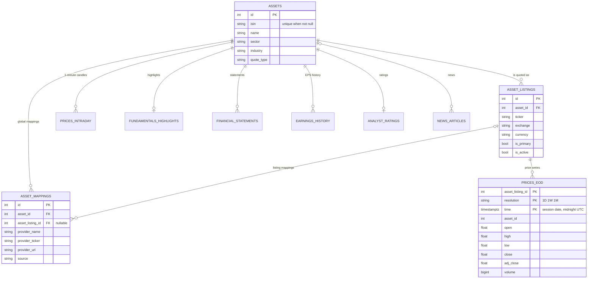

# Data Model & Schema Reference

The identity of an instrument has three levels:

- `assets` — the instrument, one per ISIN;
- `asset_listings` — where it is quoted: ticker, exchange, currency;
- `asset_mappings` — the identifier of the instrument or of a listing at a given provider (Yahoo symbol, page URL…).

The same ISIN is listed under several tickers and currencies; the same ticker can name different instruments on different markets; and providers do not accept the same identifiers. `models.py` is the reference for every column.

## Identity

| Table | Rule |
|---|---|
| `assets` | One row per ISIN: partial unique index `uq_assets_isin_not_null` (`WHERE isin IS NOT NULL`) |
| `asset_listings` | Unique on `(asset_id, ticker, exchange, currency)` (`uq_asset_listing_identity`); `is_primary` marks the default listing |
| `asset_mappings` | Unique on `(asset_listing_id, provider_name)`. A mapping without listing applies to every listing of the instrument. `source` says where the identifier comes from: `csv_import`, `manual`, `isin_search`, `ticker_check`, `symbol_not_found` |

The Yahoo Finance mapping of a listing holds its **verified symbol** — found from the ISIN and checked against the listing's currency — or, with `source = 'manual'`, a symbol you set by hand.

## Prices

| Table | Description |
|---|---|
| `prices_eod` | TimescaleDB hypertable. Key `(asset_listing_id, resolution, time)`: one series per listing and resolution. `time` is the trading session date at midnight UTC. Chunks older than 14 days are compressed (segmented by listing and resolution) |
| `prices_weekly`, `prices_monthly` | Continuous aggregates of the daily bars, per listing, refreshed daily; used when no `1W`/`1M` row is stored for the listing |
| `prices_intraday` | Hypertable of 1-minute candles from the realtime stream, per instrument, one-day chunks, purged after 30 days |
| `realtime_subscriptions` | Streamed tickers, restored at start-up |
| `ingest_log` | One row per ingestion: status, source, rows, range, duration, error |

## Fundamentals

| Table | Description |
|---|---|
| `fundamentals_highlights` | Last snapshot of an instrument (valuation, profitability, dividend, short interest, solvency). `dividend_yield` is a ratio |
| `financial_statements` | One row per statement type (income, balance, cash flow), fiscal period and frequency. A fiscal year is three rows; calculations put them together with `financials/fiscal_years.py` |
| `earnings_history`, `earnings_trend` | Actual vs estimated EPS; analyst estimates for `0q`, `+1q`, `0y`, `+1y` |
| `analyst_ratings` | Consensus, target price, rating counts |
| `esg_scores` | E/S/G scores and 15 controversy flags |
| `outstanding_shares_history` | Share count history |
| `etf_details`, `etf_holdings` | Read for ETFs but not written by the application today |
| `fundamentals` | Legacy table, no longer written |

These tables are written by the deep enrichment from Yahoo Finance (`/fundamental/deep`, `import_assets.py --enrich-only`).

## News, macro and usage

| Table | Description |
|---|---|
| `news_articles` | Unique on `url`; indexes for the feed and the statistics. Old articles are not purged automatically |
| `macro_rates_cache` | Series read from FRED, unique on `(series_id, observation_date)` |
| `usage_logs` | One row per API request, written in background batches; IP not kept unless `USAGE_LOG_IP` asks for it; purged after `USAGE_LOG_RETENTION_DAYS` |

## Monitoring

| Table | Description |
|---|---|
| `provider_health_log` | Hypertable, one row per checked value (`check_type` `canary`, `realtime` or `consensus`), 30-day retention |
| `provider_health_daily` | Daily aggregate per provider, unique on `(provider_name, date)` |
| `provider_alerts` | Alerts `canary_failed` and `high_outlier_rate`, active or resolved |
