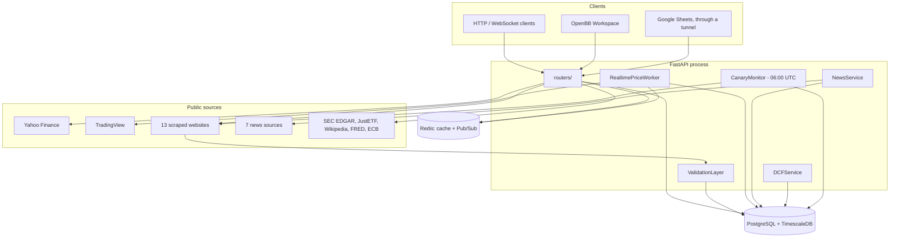

# Architecture Overview

A Fonrex instance is one FastAPI process, a PostgreSQL/TimescaleDB database and a Redis server. Everything that collects data — the fundamentals providers, the news providers, the realtime worker, the daily canary — runs inside the API process.

## Main flows

- **End-of-day prices**: `GET /eod` reads `prices_eod`; when nothing is stored, the listing is ingested from Yahoo Finance (with the symbol verified for the listing), or TradingView as a fallback.
- **Fundamentals**: `GET /fundamental` calls the providers in parallel, validates their values (range and consensus checks), and renders one document choosing each figure from Yahoo, the stored figures, then the scraped providers.
- **Realtime**: the worker streams TradingView ticks into Redis (`quote:{ticker}`, `price:{ticker}`) and `prices_intraday`; each WebSocket client listens to the Redis channel of its ticker.
- **Indicators and valuation** are computed from what the database holds.

## Start-up

`entrypoint.sh` waits for PostgreSQL and Redis, applies `alembic upgrade head`, optionally imports `data/etf.csv` (`SEED_ON_FIRST_RUN`), then starts Gunicorn with `WEB_CONCURRENCY` workers (1 by default).

`main.py` then creates the services and publishes them in `app.state`: database and Redis clients, ingestion, indicators, realtime worker (restores the stored subscriptions), news, FRED, ECB, DCF, validation layer, canary monitor and its daily scheduler, usage recorder. The start is tolerant: a service that fails to start leaves its routes answering `503` while the rest of the API runs. A provider that cannot be imported is listed by `GET /health`.

`main.py` never changes the schema: it compares the database revision with the Alembic head and marks the database unavailable when they differ.

**Keep one worker.** Realtime streams, WebSocket clients and the daily canary live in the memory of the process: each extra Gunicorn worker would open its own streams and run its own canary.

## Security

Every route except `/health`, `/docs`, `/redoc`, `/openapi.json`, `/widgets.json`, `/apps.json`, `/favicon.ico` and `/static/*` requires an API key. Read-only keys can call the `GET` routes and the two computation routes `POST /technical/batch` and `POST /dcf/{ticker}`; they cannot clear the cache, clean the database, ingest or start streams. With no key configured, every protected request is refused.

## Code layout

| Package | Role |
|---|---|
| `routers/` | HTTP adapters, one module per feature |
| `use_cases/` | Application logic of fundamentals, specialised providers and realtime, behind ports |
| `historical/`, `technical/`, `news/`, `valuation/`, `monitoring/`, `macro/` | Feature services |
| `database/`, `cache/` | SQLAlchemy repositories, Redis |
| `financials/providers/`, `news/providers/` | Providers, all built on `BaseFinancialProvider` |
| `realtime/` | Realtime worker and WebSocket connection manager |
| `integrations/openbb/` | OpenBB widgets, dashboards and adapters |
| `zipline_bundle/` | Zipline data bundle (not imported by the API) |

The repository's `ARCHITECTURE.md` is the detailed reference: module map, every route, every migration, known limits.
