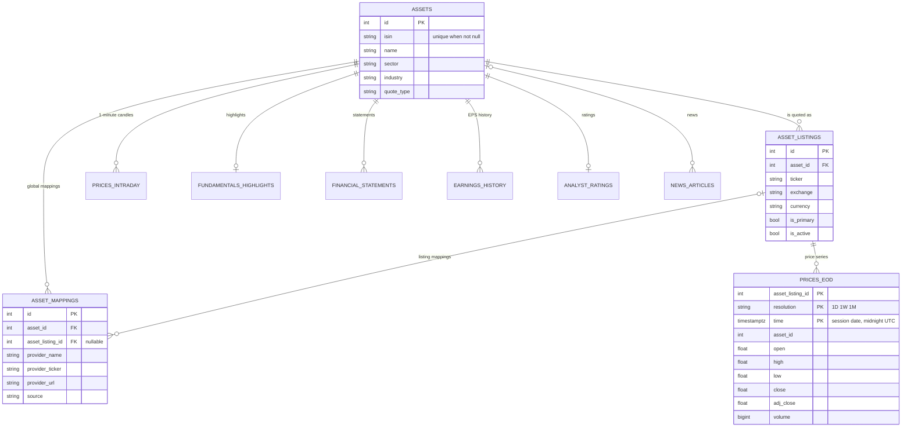

# Modèle de données & référence du schéma

L'identité d'un instrument a trois niveaux :

- `assets` : l'instrument, un par ISIN ;
- `asset_listings` : où il est coté (ticker, place, devise) ;
- `asset_mappings` : l'identifiant de l'instrument ou d'une cotation chez un fournisseur donné (symbole Yahoo, URL de page…).

Un même ISIN est coté sous plusieurs tickers et devises ; un même ticker peut désigner des instruments différents sur des marchés différents ; et les fournisseurs n'acceptent pas les mêmes identifiants. `models.py` fait référence pour chaque colonne.

## Identité

| Table | Règle |
|---|---|
| `assets` | Une ligne par ISIN : index unique partiel `uq_assets_isin_not_null` (`WHERE isin IS NOT NULL`) |
| `asset_listings` | Unique sur `(asset_id, ticker, exchange, currency)` (`uq_asset_listing_identity`) ; `is_primary` marque la cotation par défaut |
| `asset_mappings` | Unique sur `(asset_listing_id, provider_name)`. Une correspondance sans cotation s'applique à toutes les cotations de l'instrument. `source` indique d'où vient l'identifiant : `csv_import`, `manual`, `isin_search`, `ticker_check`, `symbol_not_found` |

La correspondance Yahoo Finance d'une cotation contient son **symbole vérifié** (trouvé à partir de l'ISIN et contrôlé par rapport à la devise de la cotation) ou, avec `source = 'manual'`, un symbole que vous avez saisi à la main.

## Prix

| Table | Description |
|---|---|
| `prices_eod` | Hypertable TimescaleDB. Clé `(asset_listing_id, resolution, time)` : une série par cotation et par résolution. `time` est la date de la séance à minuit UTC. `open`, `high`, `low`, `close` sont les prix négociés ajustés des splits ; `adj_close` est aussi ajusté des dividendes. Les chunks de plus de 14 jours sont compressés (segmentés par cotation et résolution) |
| `price_series_adjustments` | Une ligne par série (cotation et résolution) : comment ses barres sont ajustées (`scheme`) et quand elle a été récupérée d'un seul tenant pour la dernière fois (`fetched_at`). Une série sans ligne est récupérée de nouveau en entier à sa prochaine ingestion |
| `prices_weekly`, `prices_monthly` | Agrégats continus des barres journalières, par cotation, rafraîchis chaque jour ; utilisés lorsqu'aucune ligne `1W`/`1M` n'est enregistrée pour la cotation |
| `prices_intraday` | Hypertable des bougies d'une minute issues du flux temps réel, par instrument, chunks d'un jour, purgée après 30 jours |
| `realtime_subscriptions` | Tickers diffusés, restaurés au démarrage |
| `ingest_log` | Une ligne par ingestion : statut, source, lignes, plage, durée, erreur |

## Fondamentaux

| Table | Description |
|---|---|
| `fundamentals_highlights` | Dernier instantané d'un instrument (valorisation, rentabilité, dividende, positions vendeuses, solvabilité). `dividend_yield` est un ratio |
| `financial_statements` | Une ligne par type d'état (compte de résultat, bilan, flux de trésorerie), période fiscale et fréquence. Un exercice correspond à trois lignes ; les calculs les regroupent avec `financials/fiscal_years.py`. `currency` est la devise des états donnée par Yahoo (`NULL` si inconnue) ; le DCF est fait dans cette devise |
| `earnings_history`, `earnings_trend` | BPA réel contre estimé ; estimations des analystes pour `0q`, `+1q`, `0y`, `+1y` |
| `analyst_ratings` | Consensus, objectif de cours, nombre de recommandations |
| `esg_scores` | Scores E/S/G et 15 indicateurs de controverse |
| `outstanding_shares_history` | Historique du nombre d'actions |
| `etf_details`, `etf_holdings` | Lues pour les ETF mais pas écrites par l'application aujourd'hui |
| `fundamentals` | Table historique, plus écrite |

Ces tables sont écrites par l'enrichissement approfondi à partir de Yahoo Finance (`/fundamental/deep`, `import_assets.py --enrich-only`).

## Actualités, macro et utilisation

| Table | Description |
|---|---|
| `news_articles` | Unique sur `url` ; index pour le flux et les statistiques. Les anciens articles ne sont pas purgés automatiquement |
| `macro_rates_cache` | Séries lues sur FRED et à la BCE (`source`), unique sur `(series_id, observation_date)` |
| `usage_logs` | Une ligne par requête API, écrite par lots en arrière-plan ; l'IP n'est pas conservée sauf si `USAGE_LOG_IP` le demande ; purgée après `USAGE_LOG_RETENTION_DAYS` |

## Facteurs et taux de change {#factors-and-exchange-rates}

| Table | Description |
|---|---|
| `factor_returns` | Rendements de la Kenneth French Data Library, en ratios et en dollars US. Clé `(dataset, frequency, period_end, factor)` ; un fichier est remplacé en entier à chaque téléchargement |
| `factor_dataset_loads` | Une ligne par fichier (jeu de données et fréquence) : date du téléchargement, première et dernière période, nombre de périodes, `source_note` (par ex. `CRSP 202608`) |
| `fx_rates` | Cours de référence de la BCE : `per_eur` unités de `currency` pour un euro, clé `(currency, rate_date)` |
| `fx_rate_loads` | Une ligne par devise : date de la dernière demande, premier et dernier jour stockés |

Voir [Facteurs Fama/French](../api-reference/factors.md).

## Surveillance

| Table | Description |
|---|---|
| `provider_health_log` | Hypertable, une ligne par valeur vérifiée (`check_type` `canary`, `realtime` ou `consensus`), rétention de 30 jours |
| `provider_health_daily` | Agrégat quotidien par fournisseur, unique sur `(provider_name, date)` |
| `provider_alerts` | Alertes `canary_failed` et `high_outlier_rate`, actives ou résolues |
