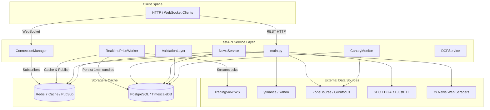

# Vue d'ensemble de l'architecture

Fonrex est conçu comme un pipeline modulaire de traitement de données financières. Il sépare les providers de données, la logique métier, les moteurs de stockage et les protocoles de transport.

## Architecture Système Haut Niveau

## Composants Clés

1. **FastAPI Transport Layer (`routers/`)**: Receives incoming REST and WebSocket requests, converts transport DTOs to internal business entities, and handles status codes.
2. **Use Case Layer (`use_cases/`)**: Contains pure application business rules. Free from FastAPI or SQLAlchemy dependencies.
3. **Storage & Services (`database/`, `cache/`, `historical/`)**: Interfaces with TimescaleDB hypertables for OHLCV bars and Redis for volatile caches.
4. **Scraping & Providers (`financials/providers/`, `news/providers/`)**: Asynchronous connectors scraping financial metrics, insider trades, and financial news.
5. **Assurance Qualité (`monitoring/`)** : Effectue la vérification du consensus en temps réel et les requêtes synthétiques canary quotidiennes automatisées auprès des providers en amont.
