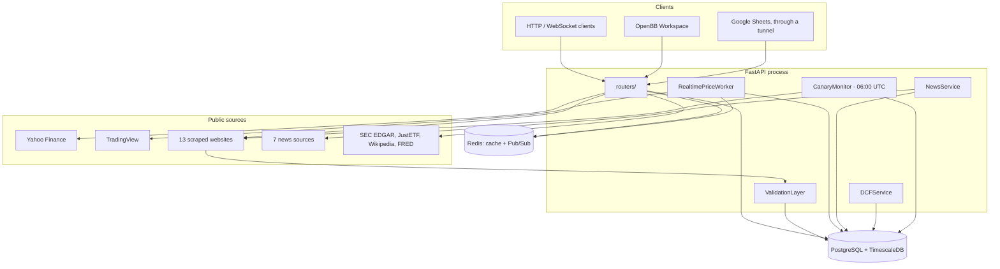

# Vue d'ensemble de l'architecture

Une instance Fonrex se compose d'un processus FastAPI, d'une base PostgreSQL/TimescaleDB et d'un serveur Redis. Tout ce qui collecte des données (les fournisseurs de fondamentaux, les fournisseurs d'actualités, le worker temps réel, le canari quotidien) s'exécute dans le processus de l'API.

```mermaid
flowchart TD
    subgraph Clients
        Client[HTTP / WebSocket clients]
        OpenBB[OpenBB Workspace]
        Sheets[Google Sheets, through a tunnel]
    end

    subgraph API [FastAPI process]
        Routers[routers/]
        Worker[RealtimePriceWorker]
        VL[ValidationLayer]
        Canary[CanaryMonitor - 06:00 UTC]
        News[NewsService]
        DCF[DCFService]
    end

    subgraph Sources [Public sources]
        YF[Yahoo Finance]
        TV[TradingView]
        Scraped[13 scraped websites]
        NewsSites[7 news sources]
        Specialised[SEC EDGAR, JustETF, Wikipedia, FRED]
    end

    Redis[(Redis: cache + Pub/Sub)]
    DB[(PostgreSQL + TimescaleDB)]

    Client --> Routers
    OpenBB --> Routers
    Sheets --> Routers
    Routers --> Redis
    Routers --> DB
    Routers --> YF
    Routers --> Scraped
    Routers --> Specialised
    Scraped --> VL
    VL --> DB
    Worker --> TV
    Worker --> Redis
    Worker --> DB
    News --> NewsSites
    News --> DB
    DCF --> DB
    Canary --> Scraped
    Canary --> DB
```

## Flux principaux

- **Cours de clôture** : `GET /eod` lit `prices_eod` ; lorsque rien n'est enregistré, la cotation est ingérée depuis Yahoo Finance (avec le symbole vérifié pour la cotation), ou depuis TradingView en repli.
- **Fondamentaux** : `GET /fundamental` appelle les fournisseurs en parallèle, valide leurs valeurs (contrôles de plage et de consensus) et produit un document en choisissant chaque chiffre chez Yahoo, puis dans les chiffres enregistrés, puis chez les fournisseurs scrapés.
- **Temps réel** : le worker diffuse les ticks TradingView dans Redis (`quote:{ticker}`, `price:{ticker}`) et dans `prices_intraday` ; chaque client WebSocket écoute le canal Redis de son ticker.
- **Indicateurs et valorisation** sont calculés à partir de ce que contient la base.

## Démarrage

`entrypoint.sh` attend PostgreSQL et Redis, applique `alembic upgrade head`, importe éventuellement `data/etf.csv` (`SEED_ON_FIRST_RUN`), puis démarre Gunicorn avec `WEB_CONCURRENCY` workers (1 par défaut).

`main.py` crée ensuite les services et les publie dans `app.state` : clients de base de données et Redis, ingestion, indicateurs, worker temps réel (qui restaure les abonnements enregistrés), actualités, FRED, DCF, couche de validation, moniteur canari et son planificateur quotidien, enregistreur d'utilisation. Le démarrage est tolérant : un service qui ne démarre pas laisse ses routes répondre `503` pendant que le reste de l'API fonctionne. Un fournisseur qui ne peut pas être importé est listé par `GET /health`.

`main.py` ne modifie jamais le schéma : il compare la révision de la base avec la tête Alembic et marque la base indisponible lorsqu'elles diffèrent.

**Gardez un seul worker.** Les flux temps réel, les clients WebSocket et le canari quotidien vivent dans la mémoire du processus : chaque worker Gunicorn supplémentaire ouvrirait ses propres flux et exécuterait son propre canari.

## Sécurité

Toutes les routes sauf `/health`, `/docs`, `/redoc`, `/openapi.json`, `/widgets.json`, `/apps.json`, `/favicon.ico` et `/static/*` exigent une clé d'API. Les clés en lecture seule peuvent appeler les routes `GET` et les deux routes de calcul `POST /technical/batch` et `POST /dcf/{ticker}` ; elles ne peuvent ni vider le cache, ni nettoyer la base, ni ingérer, ni démarrer de flux. Sans aucune clé configurée, toute requête protégée est refusée.

## Organisation du code

| Paquet | Rôle |
|---|---|
| `routers/` | Adaptateurs HTTP, un module par fonctionnalité |
| `use_cases/` | Logique applicative des fondamentaux, des fournisseurs spécialisés et du temps réel, derrière des ports |
| `historical/`, `technical/`, `news/`, `valuation/`, `monitoring/`, `macro/` | Services fonctionnels |
| `database/`, `cache/` | Dépôts SQLAlchemy, Redis |
| `financials/providers/`, `news/providers/` | Fournisseurs, tous construits sur `BaseFinancialProvider` |
| `realtime/` | Worker temps réel et gestionnaire de connexions WebSocket |
| `integrations/openbb/` | Widgets, tableaux de bord et adaptateurs OpenBB |
| `zipline_bundle/` | Bundle de données Zipline (non importé par l'API) |

Le fichier `ARCHITECTURE.md` du dépôt est la référence détaillée : carte des modules, chaque route, chaque migration, limites connues.
