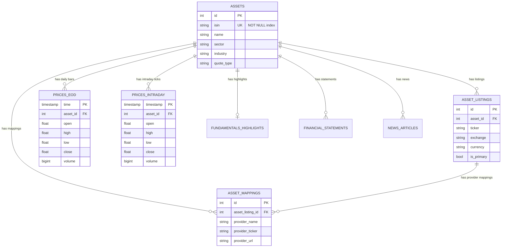

# 数据模型与 Mode 模式参考

Fonrex uses a 3-tier asset representation schema (`assets` ➔ `asset_listings` ➔ `asset_mappings`) to cleanly handle instruments, multi-exchange listings, and provider-specific identifiers.

## Entity Relationship Diagram

## Key Database Tables

### 1. `assets`
Represents the canonical financial instrument (e.g., Apple Inc. or Airbus SE).
- **`id`** (Integer, PK, Autoincrement)
- **`isin`** (String(12), Partial Unique Index `uq_assets_isin_not_null` WHERE `isin IS NOT NULL`)
- **`name`** (String(255))
- **`sector`** / **`industry`** (String(100))
- **`quote_type`** (Enum: `EQUITY`, `ETF`, `MUTUALFUND`, `INDEX`)

### 2. `asset_listings`
Represents exchange-specific trading listings.
- Unique Constraint: `uq_asset_listing_identity` on `(asset_id, ticker, exchange, currency)`.
- Flags: `is_primary` (Boolean), `is_active` (Boolean).

### 3. `asset_mappings`
Maps external provider tickers or custom page URLs.
- Unique Constraint: `(asset_listing_id, provider_name)`.

### 4. `prices_eod` (PostgreSQL Table)
Daily historical OHLCV price series.
- Unique Index: `ix_prices_eod_asset_resolution_time` on `(asset_id, resolution, time)`.

### 5. `prices_intraday` (TimescaleDB Hypertable)
High-frequency 1-minute candle storage.
- Partitioned daily by time interval (`INTERVAL '1 day'`).
- Automated retention policy: Purges chunks older than 30 days.

### 6. `provider_health_log` (TimescaleDB Hypertable)
Outlier checks and health metrics per provider.
- Composite Primary Key: `(id, checked_at)`.
- Automated retention policy: 30 days.
