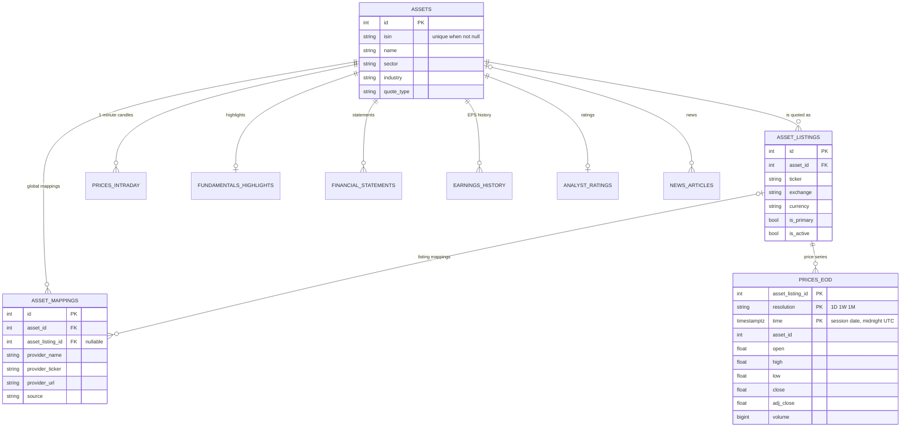

# 数据模型与 Schema 参考

金融工具的身份分为三个层级：

- `assets`——金融工具，每个 ISIN 一个；
- `asset_listings`——其报价位置：代码、交易所、货币；
- `asset_mappings`——金融工具或某个上市品种在特定数据提供方处的标识符（Yahoo 代码、页面 URL……）。

同一个 ISIN 会以多个代码和货币上市；同一个代码在不同市场上可能指代不同的金融工具；而各数据提供方接受的标识符也不尽相同。`models.py` 是所有列的权威参考。

```mermaid
erDiagram
    ASSETS ||--o{ ASSET_LISTINGS : "is quoted as"
    ASSETS ||--o{ ASSET_MAPPINGS : "global mappings"
    ASSET_LISTINGS |o--o{ ASSET_MAPPINGS : "listing mappings"
    ASSET_LISTINGS ||--o{ PRICES_EOD : "price series"
    ASSETS ||--o{ PRICES_INTRADAY : "1-minute candles"
    ASSETS ||--o| FUNDAMENTALS_HIGHLIGHTS : "highlights"
    ASSETS ||--o{ FINANCIAL_STATEMENTS : "statements"
    ASSETS ||--o{ EARNINGS_HISTORY : "EPS history"
    ASSETS ||--o| ANALYST_RATINGS : "ratings"
    ASSETS |o--o{ NEWS_ARTICLES : "news"

    ASSETS {
        int id PK
        string isin "unique when not null"
        string name
        string sector
        string industry
        string quote_type
    }
    ASSET_LISTINGS {
        int id PK
        int asset_id FK
        string ticker
        string exchange
        string currency
        bool is_primary
        bool is_active
    }
    ASSET_MAPPINGS {
        int id PK
        int asset_id FK
        int asset_listing_id FK "nullable"
        string provider_name
        string provider_ticker
        string provider_url
        string source
    }
    PRICES_EOD {
        int asset_listing_id PK
        string resolution PK "1D 1W 1M"
        timestamptz time PK "session date, midnight UTC"
        int asset_id
        float open
        float high
        float low
        float close
        float adj_close
        bigint volume
    }
```

## 身份

| 表 | 规则 |
|---|---|
| `assets` | 每个 ISIN 一行：部分唯一索引 `uq_assets_isin_not_null`（`WHERE isin IS NOT NULL`） |
| `asset_listings` | 在 `(asset_id, ticker, exchange, currency)` 上唯一（`uq_asset_listing_identity`）；`is_primary` 标记默认上市品种 |
| `asset_mappings` | 在 `(asset_listing_id, provider_name)` 上唯一。不关联上市品种的映射适用于该金融工具的所有上市品种。`source` 说明标识符的来源：`csv_import`、`manual`、`isin_search`、`ticker_check`、`symbol_not_found` |

上市品种的 Yahoo Finance 映射保存其**已验证的代码**——根据 ISIN 查得并按上市品种的货币核对——或者在 `source = 'manual'` 时，保存你手动设置的代码。

## 价格

| 表 | 说明 |
|---|---|
| `prices_eod` | TimescaleDB 超表。键为 `(asset_listing_id, resolution, time)`：每个上市品种和分辨率对应一个序列。`time` 是交易日日期，取 UTC 午夜时刻。超过 14 天的分块会被压缩（按上市品种和分辨率分段） |
| `prices_weekly`, `prices_monthly` | 基于日线的连续聚合，按上市品种计算，每天刷新；当该上市品种没有存储 `1W`/`1M` 行时使用 |
| `prices_intraday` | 来自实时数据流的 1 分钟 K 线超表，按金融工具存储，分块为一天，30 天后清除 |
| `realtime_subscriptions` | 正在推送的代码，启动时恢复 |
| `ingest_log` | 每次采集一行：状态、来源、行数、区间、耗时、错误 |

## 基本面

| 表 | 说明 |
|---|---|
| `fundamentals_highlights` | 金融工具的最新快照（估值、盈利能力、股息、空头头寸、偿债能力）。`dividend_yield` 为比率 |
| `financial_statements` | 每种报表类型（利润表、资产负债表、现金流量表）、财务期间和频率各一行。一个财年为三行；计算时通过 `financials/fiscal_years.py` 将它们组合起来 |
| `earnings_history`, `earnings_trend` | 实际与预估每股收益；分析师对 `0q`、`+1q`、`0y`、`+1y` 的预估 |
| `analyst_ratings` | 一致评级、目标价、评级数量 |
| `esg_scores` | E/S/G 评分及 15 个争议标志 |
| `outstanding_shares_history` | 股本数量历史 |
| `etf_details`, `etf_holdings` | 用于读取 ETF 信息，但目前应用不会写入 |
| `fundamentals` | 旧版表，不再写入 |

这些表由基于 Yahoo Finance 的深度补全写入（`/fundamental/deep`、`import_assets.py --enrich-only`）。

## 新闻、宏观与使用情况

| 表 | 说明 |
|---|---|
| `news_articles` | 在 `url` 上唯一；为信息流和统计建有索引。旧文章不会自动清除 |
| `macro_rates_cache` | 从 FRED 读取的序列，在 `(series_id, observation_date)` 上唯一 |
| `usage_logs` | 每个 API 请求一行，由后台批量写入；除非 `USAGE_LOG_IP` 要求，否则不保留 IP；在 `USAGE_LOG_RETENTION_DAYS` 之后清除 |

## 监控

| 表 | 说明 |
|---|---|
| `provider_health_log` | 超表，每个被检查的值一行（`check_type` 为 `canary`、`realtime` 或 `consensus`），保留 30 天 |
| `provider_health_daily` | 每个数据提供方的每日聚合，在 `(provider_name, date)` 上唯一 |
| `provider_alerts` | `canary_failed` 和 `high_outlier_rate` 告警，包括活跃和已解决的 |
