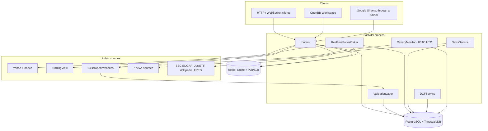

# 架构概览

一个 Fonrex 实例由一个 FastAPI 进程、一个 PostgreSQL/TimescaleDB 数据库和一个 Redis 服务器组成。所有收集数据的组件——基本面数据提供方、新闻数据提供方、实时 worker、每日金丝雀——都运行在 API 进程内。

## 主要数据流

- **日终价格**：`GET /eod` 读取 `prices_eod`；如果没有已存储的数据，则从 Yahoo Finance（使用为该上市品种验证过的代码）采集该上市品种，TradingView 作为后备。
- **基本面**：`GET /fundamental` 并行调用各数据提供方，校验其返回值（范围检查和一致性检查），并渲染一份文档，每项数据依次从 Yahoo、已存储的数据、抓取类数据提供方中选取。
- **实时**：worker 将 TradingView 的 tick 推送到 Redis（`quote:{ticker}`、`price:{ticker}`）和 `prices_intraday`；每个 WebSocket 客户端监听其代码对应的 Redis 频道。
- **指标和估值**基于数据库中已有的数据计算。

## 启动

`entrypoint.sh` 等待 PostgreSQL 和 Redis 就绪，执行 `alembic upgrade head`，可选地导入 `data/etf.csv`（`SEED_ON_FIRST_RUN`），然后以 `WEB_CONCURRENCY` 个 worker（默认 1 个）启动 Gunicorn。

随后 `main.py` 创建各项服务并将其发布到 `app.state`：数据库和 Redis 客户端、采集、指标、实时 worker（恢复已存储的订阅）、新闻、FRED、DCF、校验层、金丝雀监控及其每日调度器、使用情况记录器。启动过程是容错的：某个服务启动失败时，其路由返回 `503`，而 API 的其余部分照常运行。无法导入的数据提供方会在 `GET /health` 中列出。

`main.py` 从不修改 Schema：它将数据库的修订版本与 Alembic head 进行比较，二者不一致时将数据库标记为不可用。

**保持只有一个 worker。** 实时数据流、WebSocket 客户端和每日金丝雀都存在于进程内存中：每增加一个 Gunicorn worker，就会打开自己的数据流并运行自己的金丝雀。

## 安全

除 `/health`、`/docs`、`/redoc`、`/openapi.json`、`/widgets.json`、`/apps.json`、`/favicon.ico` 和 `/static/*` 之外，所有路由都需要 API 密钥。只读密钥可以调用 `GET` 路由以及两个计算路由 `POST /technical/batch` 和 `POST /dcf/{ticker}`；它们不能清除缓存、清理数据库、执行采集或启动数据流。如果未配置任何密钥，所有受保护的请求都会被拒绝。

## 代码结构

| 包 | 作用 |
|---|---|
| `routers/` | HTTP 适配器，每个功能一个模块 |
| `use_cases/` | 基本面、专项数据提供方和实时功能的应用逻辑，位于端口之后 |
| `historical/`, `technical/`, `news/`, `valuation/`, `monitoring/`, `macro/` | 功能服务 |
| `database/`, `cache/` | SQLAlchemy 仓储、Redis |
| `financials/providers/`, `news/providers/` | 数据提供方，全部基于 `BaseFinancialProvider` 构建 |
| `realtime/` | 实时 worker 和 WebSocket 连接管理器 |
| `integrations/openbb/` | OpenBB 组件、仪表板和适配器 |
| `zipline_bundle/` | Zipline 数据包（API 不导入） |

仓库中的 `ARCHITECTURE.md` 是详细参考：模块地图、所有路由、所有迁移以及已知限制。
